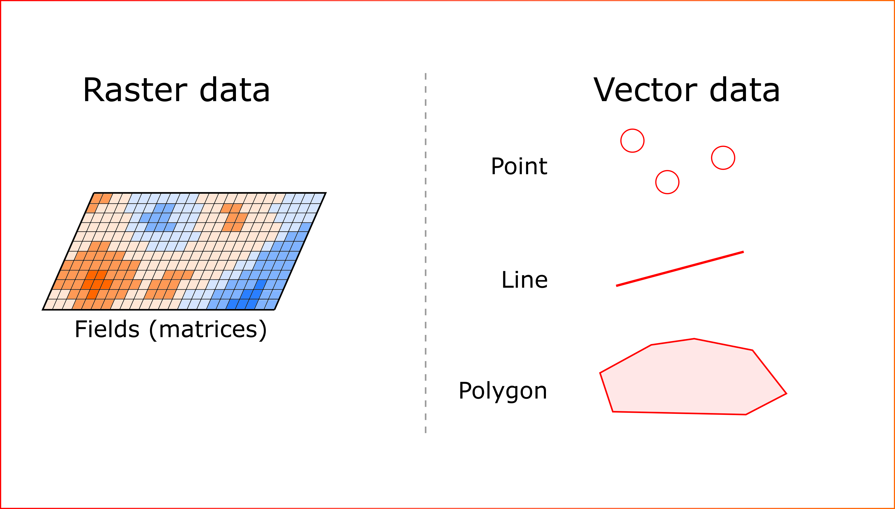
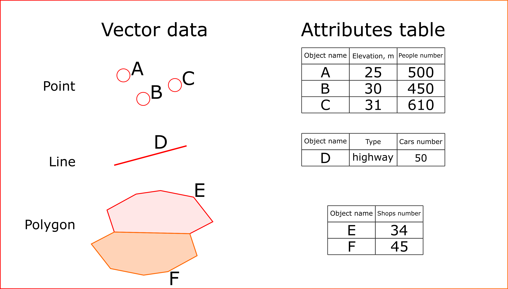
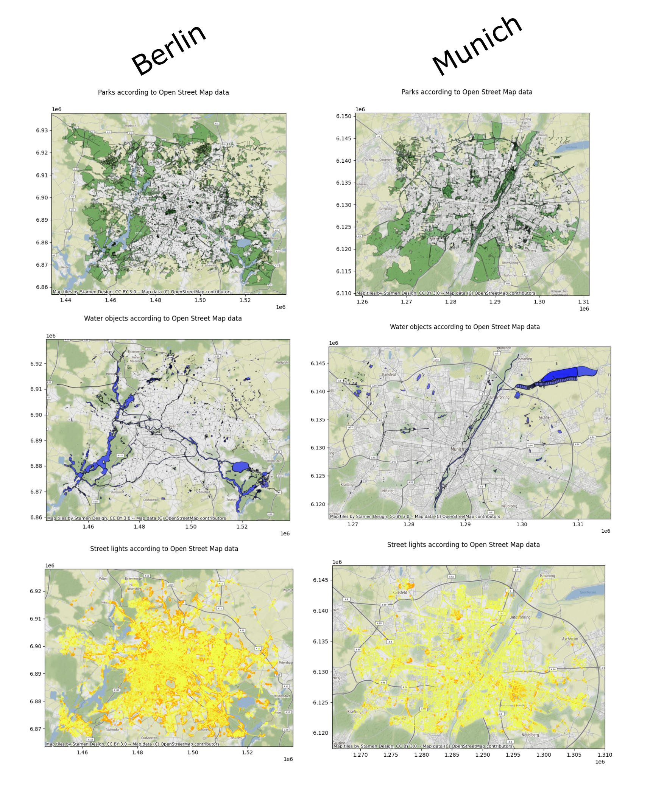
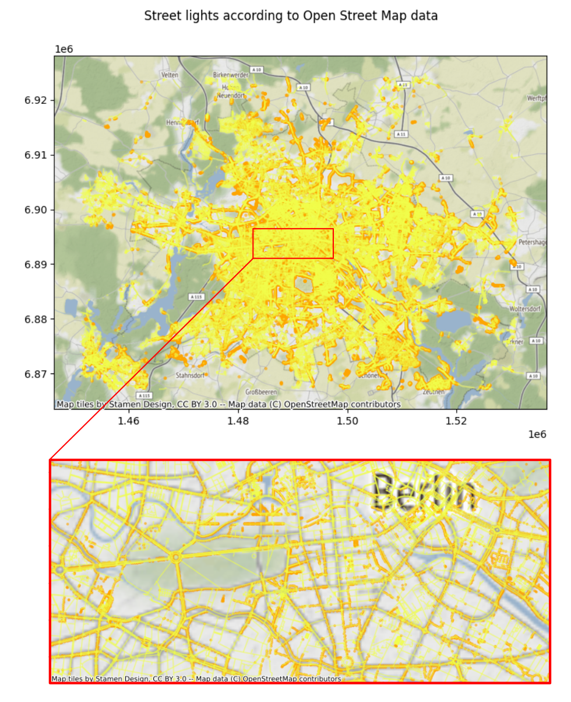
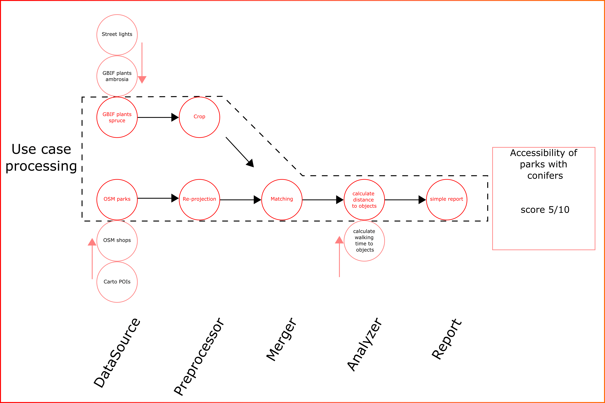

# Functionality review

Welcome to brief **estaty** documentation. On this page you will find a detailed description of the features of this tool. 
If you don't have a good understanding of how to work with spatial data - don't worry! We will explain everything to you in detail here.

## Brief dive into spatial data processing

The variety of spatial data can be reduced to two large groups: raster and vector. Vector data can be presented as follows: point data, lines, polygons (Figure 1). 
So, estaty reduces completely all assimilated data to the following four types.

Figure 1. Possible types of spatial data

For each vector object, information about its properties (attributes) is 
stored into specific table - attributes table. It is the common format of spatial data storage (Figure 2). 
Thus it is possible to analyse not only the geometry of the vector layers, but also their quantitative characteristics. 

Figure 2. Attributes table for spatial vector objects

Esaty is capable to obtain data via API from different services, but the basic one is 
[Open Street Map](https://en.wikipedia.org/wiki/OpenStreetMap) (OSM). Some examples of vector data obtained  from OSM can be seen on Figure 3.

Figure 3. Examples of OSM data for Berlin and Munich

Take a closer look at the lighting data in Berlin (Figure 4). In the figure we can see that the lighting data is represented by both polygons and lines (yellow) and points (orange).

Figure 4. Berlin street lights with different geometries

## Module architecture description

The module thus downloads spatial data in just four formats (1 raster fields and 3 vector). The module is designed so that the most important parts are isolated from each other (multi-layer architecture). The `**DataSource**` layer is responsible for loading and generalising the data. So, there are exists the following 5 layers: 

- **`DataSource`**  - load and cache data,  reduce data to known and commonly used types;
- **`Preprocessor`** - preprocessing operation to prepare data for merging. For example, assign new CRS (re-projection);
- **`Merger`**  - merge raster and vector data if it is required;
- **`Analyzer`** - core of the system - use simple data representations and primitives to constract sequential analysis pipelines;
- **`Report`** - submodule for preparing PDF reports, data visualization and data send operations (for example POST request to desired service)

All above submodules can be flexibly configured to create custom data analysis pipelines (Animation 1).

Animation 1. Key concept of estaty platform for data aggregation and use cases

As can be seen from animation the kay feature for platform is “modularity”. This means that the types of analysis implemented for one data type can be applied to new ones. The form of the data processing pipeline can be flexible. For example, additional data sources can be added or removed. 

The module implements a system of presets that allows to run template use cases for selected properties. Or the pipelines can be collected manually. 

An important note: the sequence of actions as well as the structure of the pipeline is not limited (only your imagination is the limit). For example, we can build the following pipeline for the analysis (Figure 5).

Figure 5. Flexible pipeline example with different action types in structure

As can be seen from figure 5, both standard spatial data processing and machine learning models can be found in the processing pipeline as well as statistical domain models, etc.